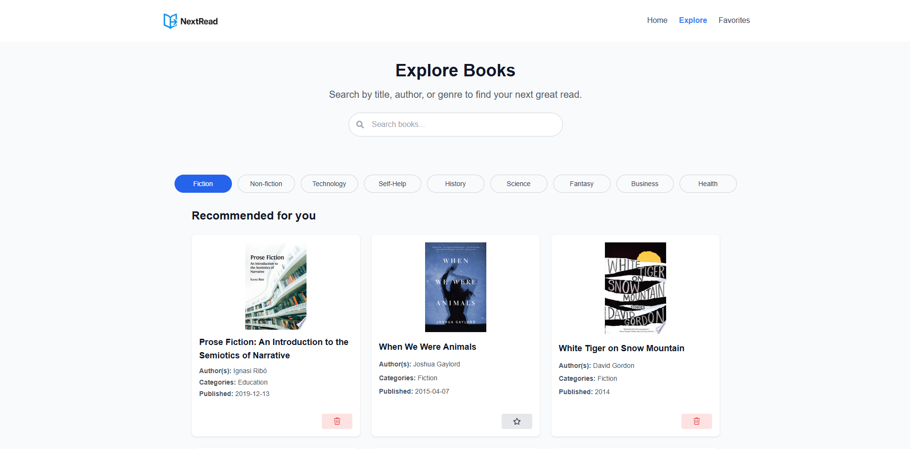
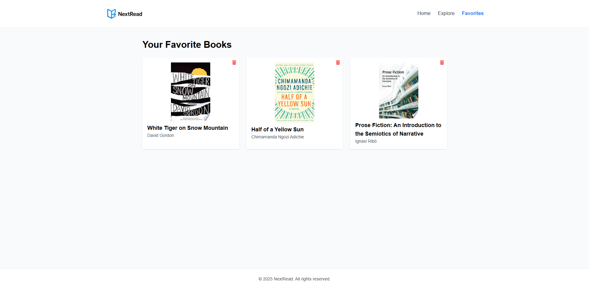

## 📚 NextRead

**NextRead** is a modern and responsive React web application that allows users to search, explore, and save their favorite books using the [Google Books API](https://developers.google.com/books). Users can view book details, filter by category, and manage a personal favorites list stored in localStorage.

---

### 🚀 Features

* 🔍 **Search books** by title, author, or genre
* 📚 **Explore curated categories** (Fiction, Non-fiction, Tech, etc.)
* ⭐️ **Save books to favorites** (persists in localStorage)
* 🗑 **Remove books from favorites**
* 💡 **Responsive design** for mobile, tablet, and desktop
* 🎨 **Smooth animations** using Framer Motion
* 📦 **Modern UI** built with Tailwind CSS

---

### 🛠 Tech Stack

* **Frontend:** React, Tailwind CSS, Framer Motion, React Router
* **API:** Google Books API
* **Icons:** React Icons
* **State Management:** React Hooks + Local Storage

---

### 📂 Project Structure

```
src/
├── components/       # Reusable UI components (Header, Footer, etc.)
├── pages/            # Main page components (Explore, Favorites)
├── hooks/            # Custom React hooks (Google Books fetching)
├── utils/            # Utility functions (favorites logic)
├── App.jsx           # Main app component and routing
├── main.jsx          # Entry point
└── index.css         # Tailwind setup
```

---

### 📸 Screenshots

| Explore Page          | Favorites Page            |
| --------------------- | ------------------------- |
|  |  |

---

### ⚙️ Getting Started

#### 1. Clone the Repository

```bash
git clone https://github.com/Dev-Rodiyat/NextRead.git
cd NextRead
```

#### 2. Install Dependencies

```bash
npm install
```

#### 3. Run the App

```bash
npm run dev
```

Visit `http://localhost:5173` in your browser.

---

### 📌 TODOs

* [ ] Add dark mode support
* [ ] Implement global favorites using context or Zustand
* [ ] Add pagination and infinite scroll
* [ ] Add toast notifications (e.g. “Saved to favorites”)

---

### 💬 Acknowledgements

* [Google Books API](https://developers.google.com/books)
* [React Icons](https://react-icons.github.io/react-icons)
* [Tailwind CSS](https://tailwindcss.com)
* [Framer Motion](https://www.framer.com/motion/)

